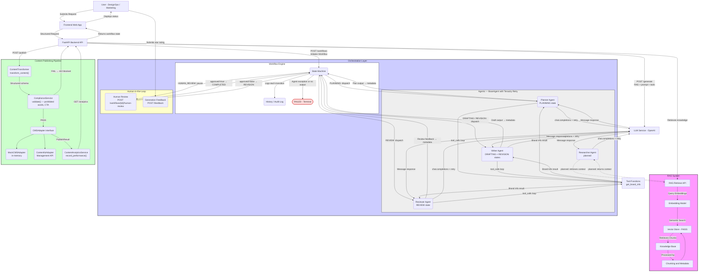
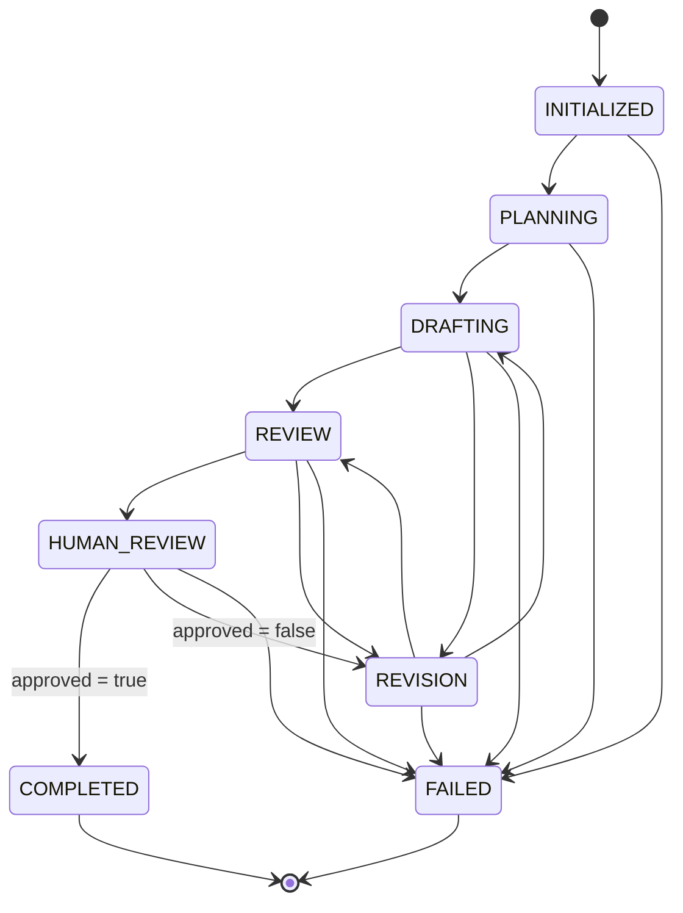
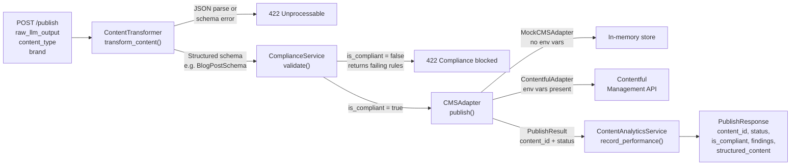

## 1. Introduction

This document outlines the initial architecture for the AI DesignOps Copilot, a system designed to automate and govern the generation of digital content (e.g., web pages, blog posts) for brand, design-system, and CMS teams. The system provides structured, compliant, and on-brand content through an AI-assisted workflow with human approval gates.

## 2. System Overview

The AI DesignOps Copilot is structured as a monorepo, separating concerns into distinct applications and libraries. This modular approach facilitates maintainability, testability, and clear ownership boundaries.

### 2.1 High-Level Component Diagram



### 2.2 Workflow State Machine

The `WorkflowEngine` enforces an explicit transition allowlist. Every call to `transition()` is validated before it commits; invalid moves raise `ValueError`.



| State | Agent Dispatched | Notes |
|---|---|---|
| `PLANNING` | `PlannerAgent` | Produces outline, audience analysis, keywords |
| `DRAFTING` | `WriterAgent` | Writes Markdown draft using plan as context |
| `REVIEW` | `ReviewerAgent` | Evaluates draft against brand and compliance rules |
| `HUMAN_REVIEW` | — | **Workflow pauses.** No LLM call. Resumes via `POST /workflows/{id}/human-review` |
| `REVISION` | `WriterAgent` | Rewrites using `human_review_feedback` from metadata |
| `COMPLETED` | — | Terminal — content approved |
| `FAILED` | — | Terminal — agent exception or retry exhaustion recorded in `metadata.error` |

### 2.3 Agent Architecture

All agents extend `BaseAgent` (`libs/llm/agents/core.py`). Each agent:

- Maintains a `conversation_history` seeded with its role-specific system prompt (`libs/llm/agents/roles.py`).
- Passes `AVAILABLE_TOOLS` on every LLM call, enabling multi-turn tool-call loops (the loop runs until `finish_reason != "tool_calls"`).
- Uses **tenacity** in `_call_llm` for automatic exponential-backoff retry (up to 3 attempts, 1 s → 10 s) on `RateLimitError`, `APIConnectionError`, `APITimeoutError`, and `InternalServerError`. Non-retryable errors (auth, bad request) fail immediately and return `None`.
- On `None` return or an unhandled exception, `WorkflowEngine.execute_agent_action()` calls `fail()`, recording `failed_at_state` and `reason` in `metadata.error` before transitioning to `FAILED`.
- `execute_agent_action()` is called via `asyncio.to_thread()` from the FastAPI handler so the sync OpenAI SDK call does not block the event loop.

### 2.4 Publish Pipeline

`POST /publish` is a sequential gate pipeline. Each stage must pass before the next runs.



## 3. Repository Structure

```text
apps/api              FastAPI backend — RAG, LLM, workflow, publish, and analytics endpoints
apps/web              Frontend application shell
libs/ai-workflows     WorkflowEngine, ContentWorkflowState, STATE_TRANSITIONS
libs/llm              BaseAgent, agent roles, prompts, tool schemas, tool functions
libs/rag              Embedding pipeline, FAISS index, retrieval helpers
libs/content_transformer  Schema models (BlogPostSchema, LandingPageSchema) and transform_content()
libs/cms-adapter      CMSAdapter interface, MockCMSAdapter, ContentfulAdapter
libs/compliance       ComplianceService — prohibited word checks, CTA validation
libs/analytics        ContentAnalyticsService — performance recording and feedback simulation
libs/ui               Shared UI components
libs/tokens           Design-token source and generated artifacts
docs                  Architecture, learning log, decisions, and interview notes
scripts               Utility scripts for setup and validation
```

## 4. Key Design Decisions

| Decision | Rationale |
|---|---|
| State machine with explicit transition allowlist | Prevents illegal state jumps; every transition is auditable in `history` |
| `HUMAN_REVIEW` as a first-class pause state | Keeps approval gates in the state machine rather than a side-channel |
| Agents call OpenAI directly (not proxied through the API layer) | Avoids an extra hop; `openai_client` is injected into `WorkflowEngine` at creation |
| `asyncio.to_thread()` for agent execution | Sync OpenAI SDK calls inside async FastAPI handlers would block the event loop; offloading to a thread pool keeps the server responsive |
| `CMSAdapter` abstract interface + `MockCMSAdapter` fallback | Adapter pattern lets the API switch between mock and real CMS without changing endpoint code; mock is used when Contentful env vars are absent |
| `ContentfulAdapter` optional import guard | `try/except ImportError` prevents startup failure when `contentful-management` is not installed; the lifespan catches init errors and falls back gracefully |
| Compliance gate before CMS publish | Publishing non-compliant content is blocked at the API layer (422) before any CMS call is made; compliance findings are included in the error response |
| `ContentAnalyticsService` records after successful publish only | Analytics are only meaningful for content that cleared compliance and reached the CMS; failures return before `record_performance()` is called |
| `sys.path.append("./libs/ai-workflows")` workaround | Hyphenated directory name `libs/ai-workflows` is not a valid Python package path; direct path append lets `from states import …` resolve |
| `load_dotenv(override=True)` | Ensures `.env` values win over any inherited shell env vars, avoiding stale key issues |
| Tenacity inside `_call_llm` (not as a method decorator) | Allows `self` and `kwargs` to be in scope for the retry closure |
| In-memory `workflow_store` and `ContentAnalyticsService._store` | Sufficient for portfolio/demo scope; replace with a database-backed store for production |
